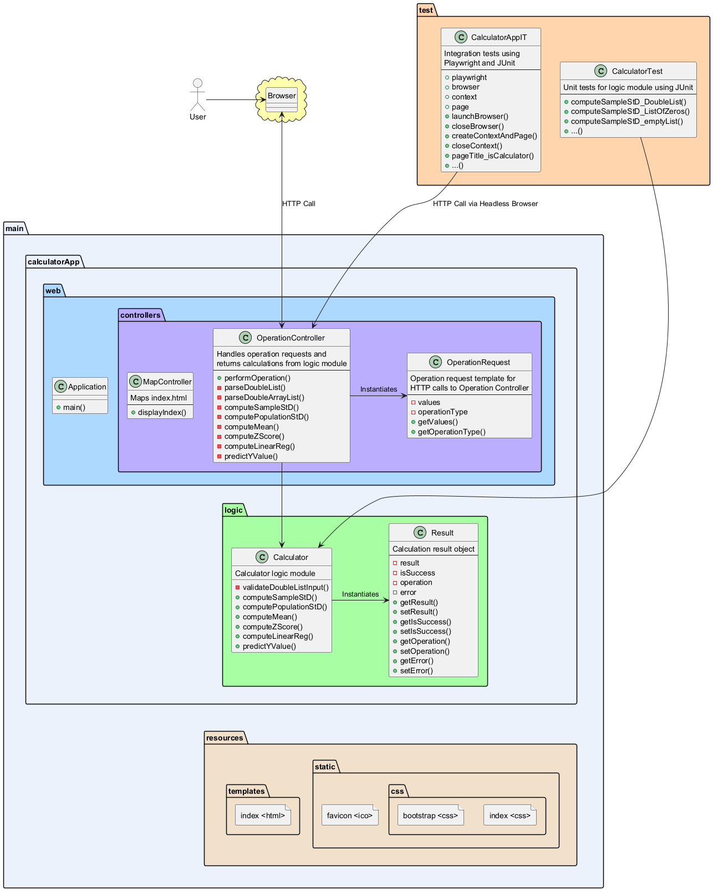

# Software Testing & QA Project: Web-Based Calculator

## Introduction

This project is a web-based statistical calculator, created for my Software Testing and Quality Assurance class.
The primary objective of this project is to demonstrate thorough unit testing and end-to-end testing on a usable web application.

The application was written in Java (version 21), using Maven as the build framework and Spring Boot as the execution framework.
JUnit is used to run the unit/end-to-end tests and Microsoft Playwright is used to perform the end-to-end tests.

### Project Characteristics
- Application performs seven different statistical functions and displays their output
- Application displays a respective error message in the case of an input or calculation error
- Full coverage is achieved for the logic module through unit testing
- End-to-end testing of each calculator function is performed

### Calculator Web App

## Table of Contents

- [Team Members](#team-members)
- [Architecture](#architecture)
- [Environment](#environment)
- [Executing the Web Application](#executing-the-web-application)
- [Executing Unit Tests](#executing-unit-tests)
- [Reviewing Unit Test Coverage](#reviewing-unit-test-coverage)
- [Executing End-To-End Tests](#executing-end-to-end-tests)
- [Final Video Presentation](#final-video-presentation)

## Team Members

This project was completed by Vera Warren-Aliff, Kennesaw State University CS Major.
- Vera's [GitHub](https://github.com/wvwa25)
- Vera's [LinkedIn](https://www.linkedin.com/in/william-warren-aliff-10712b150/)

## Architecture

### Overview

This calculator web application is based on an MVC (Model-View-Controller) design.

The `MapController` class maps the main webpage, or "view," to the server.
The user interacts with this view, which then passes HTTP requests to the `OperationController` class, which acts as a REST API for a stateless exchange of data.
This class passes these requests to the "model", or in this case, the *main.logic* module.
`Calculator` methods are called in the form of a `Result` object, which is then forwarded to the view.

### Demonstration of MVC Design Pattern

### UML Class Diagram

A detailed UML class diagram was created for this project using PlantUML, as seen below.
This diagram depicts application structure and data flow, from user input to backend logic.

Design Notes:
- `Calculator` logic was written using TDD (test-driven development) principles for cleanliness
- Methods within `Calculator` return a `Result` object for object-oriented modularity
- UI design is based on a [mockup](https://app.moqups.com/MvLts3wDDVQ8TNQBIdQN5nOCilbNhjYo/view/page/ac244bb80) provided by instructor

### Directory Structure

The organization of my project directory is based on the Maven [Standard Directory Layout]((https://maven.apache.org/guides/introduction/introduction-to-the-standard-directory-layout.html)) guidelines given by Apache Maven Project.
The below screenshot from IntelliJ demonstrates the specifics of my project layout.

## Executing the Web Application

This is a cross-platform application and should work in Windows 10+, Mac OSx Ventura+, and Linux environments.
Please note that this application has only been carefully tested in Windows, so a virtual machine may be necessary for running all subsequent execution contexts.

To prepare your environment to execute this application:
1. [Install the latest Java runtime for your system.](https://www.java.com/en/download/manual.jsp)

-----

>  [!IMPORTANT]
> Application execution requires a recent installation of Java.

### Running JAR Executable
1. Clone this GitHub repository OR download [calculatorApp-1.0.jar](target/calculatorApp-1.0.jar) from the target folder
2. Open a terminal at the directory with the calculatorApp-1.0.jar download
3. Enter the following command into the terminal:
`java -jar calculatorApp-1.0.jar`
4. Open a web browser and go to http://localhost:8080

-----

Alternatively, you may run the project with the Maven Wrapper and Spring Boot.

### Running with Maven Wrapper
1. Clone this GitHub repository
2. Open a terminal in the project root directory
3. Enter the following command into the terminal:
`mvnw spring-boot:run` 
4. Open a web browser and go to http://localhost:8080

## Executing Unit Tests

>  [!IMPORTANT]
> Unit Test execution will require cloning this GitHub repository.

### Executing JUnit Tests with Maven Wrapper

Unit tests were configured using Maven Surefire to run in isolation when using the Maven `test` command.

1. After cloning the repo, open a command terminal in the project root directory
2. Enter the following command into the terminal: `mvnw test`

To better visualize the completion of unit tests, this [treeview extension](https://medium.com/wearewaes/my-journey-to-a-clear-test-output-in-maven-df82fe272249) was added to the Maven SureFire configuration.
This extension outputs a tree diagram into the terminal to demonstrate the results of each individual unit test.
When executing unit tests, an output such as the one below should be seen.

## Reviewing Unit Test Coverage

Using comprehensive unit test cases, 100% line and branch coverage was achieved for the logic module (package *calculatorApp.logic*).
A screenshot of the coverage report from IntelliJ coverage plugin is shown below.

## Executing End-To-End Tests

>  [!IMPORTANT]
> End-to-end Test execution will require cloning this GitHub repository.

To demonstrate the functionality of Microsoft Playwright, I added a configuration to my CalculatorAppIT class to open Playwright in headed browser mode.
This will allow Playwright tests to be seen in real time as they execute.

### Playwright in Action

### Executing Playwright End-to-end Tests with Maven Wrapper

End-to-end tests were configured using Maven Failsafe to run when using the Maven `verify` command.

1. After cloning the repo, open a command terminal in the project root directory
2. Enter the following command into the terminal: `mvnw verify -DskipSurefire=true`

> The `-DskipSurefire=true` argument enables Failsafe to run E2E tests without running unit tests as well.

## Final Video Presentation

#### Last but not least, the video presentation for this project may be viewed on [Vimeo](https://vimeo.com/1035858697).
This presentation showcases the  architecture, functionality, and testing of this application.

*Thank you for checking out my work and have a good one! :-D*

*-Vera*

